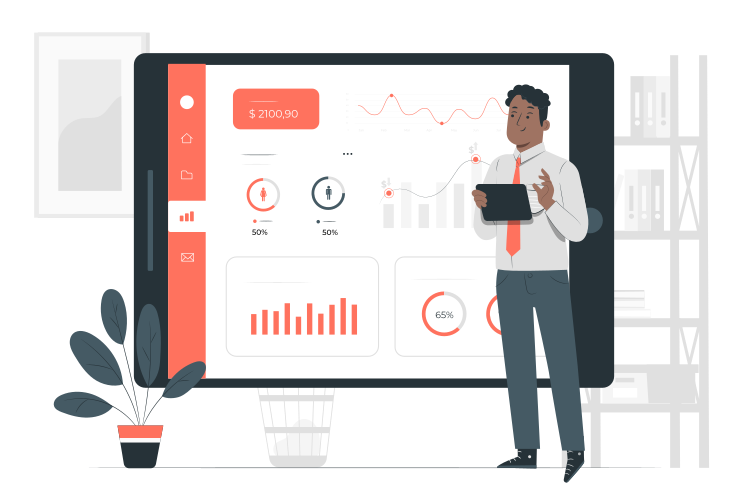

# Data Pre-processing and Visualization

  

Hello there 👋👋👋
+ This repository is meant to act as a journal, notebook, or record of my progress throughout my learning process 📓 
+ I've included notes/comments expressing my understanding of the concepts, references to official documentation, and loads of fun exercises—all while working with real-world Datasets.  
+ What's the end goal after this, you might ask? This should be a launchpad from which I wish to land softly into Machine Learning.

## Milestones ⛳
**Concepts yet to be covered:**  
1. [x] ~~Reading Datasets~~
2. [x] ~~Basic DataFrame computations~~
3. [x] ~~Panda Series, Columns and basic plots~~
4. [x] ~~Indexing and sorting~~
5. [x] ~~Filtering DataFrames~~
6. [x] ~~Adding / Removing columns & rows from a DataFrame~~
7. [x] ~~Updating values~~
8. [ ] Working with types and `Na` values
9. [ ] Working with Dates and Time
10. [ ] `Matplotlib`
11. [ ] Revisiting plotting with pandas
12. [ ] Grouping and aggregating
13. [ ] Hierarchical indexing
14. [ ] Working with text
15. [ ] `Apply`, `Map` & `Applymap`
16. [ ] Combining Series and DataFrames
17. [ ] `Seaborn`
18. [ ] Seaborn categorical plots
19. [ ] Controlling Seaborn Aesthetics

## Tools ⚒
1. [Google Colab](https://colab.google/) - A hosted Jupyter Notebook service by Google.
2. [Matplotlib](https://matplotlib.org/) - A comprehensive library for making static, animated, and interactive visualizations in Python.
3. [Seaborn](https://seaborn.pydata.org/) - A Python data visualization library based on Matplotlib.
4. [Pandas](https://pandas.pydata.org/docs/index.html) - An open-source data analysis and manipulation tool built on top of Python programming language.

## Datasets 📚
+ Due to the substantial size of the Datasets used, the datasets could not be included here 💔
+ However, they can be downloaded from the [Kaggle](https://www.kaggle.com/datasets) website.
